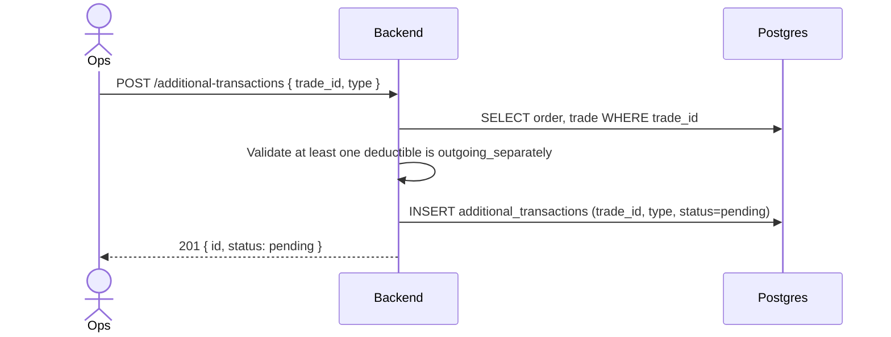
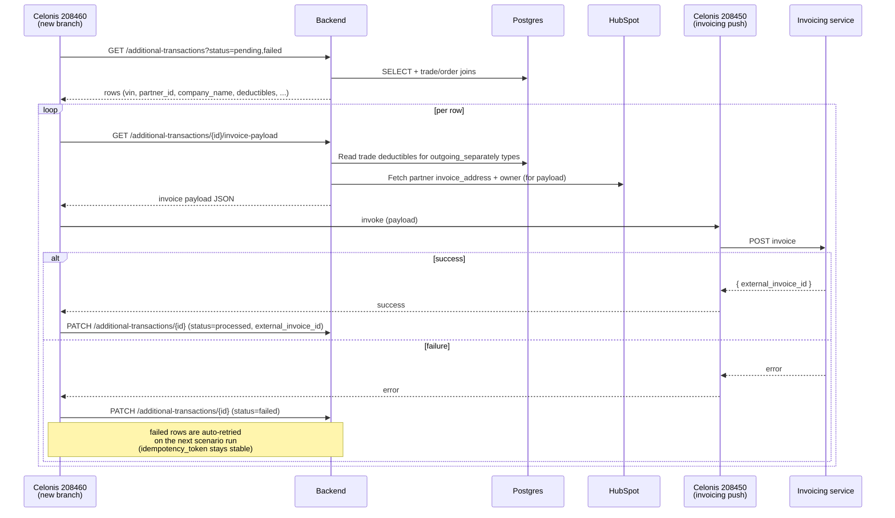

# Separate Deductible Invoicing — RFC

**Status:** Draft
**Author:** Ana Costa
**Pillar:** buyer
**Last updated:** 2026-04-28 (Confluence v10)
**Reviewers:** Mario Schiefer (PM) · Marco Milovanovic (EM)
**Related:** [PRD](../../../product/PRDs/buyer/separate-deductible-invoicing-prd.md) · [Confluence PRD](https://finn.atlassian.net/wiki/spaces/FP/pages/4824694814) · [Confluence Design](https://finn.atlassian.net/wiki/spaces/FP/pages/4828463224) · Jira epic [FRT-1986](https://finn.atlassian.net/browse/FRT-1986)

---

## 1. Context

Today, when a wholesale vehicle is sold, the three deductibles (damage, mileage, age) are merged into the main outgoing invoice generated from `invoice_items` whose corresponding `orders.{damage|mileage|age}_invoice_item_type = outgoing`.

The PRD asks for the ability to **invoice deductibles separately** from the main wholesale invoice so finance/ops can:

- Issue a stand-alone "deductibles invoice" once appraisal is complete (often after the main invoice has already gone out).
- Keep the main invoice clean of post-hoc deductible adjustments.
- Preserve the current option to still bundle deductibles into the main invoice (per-deductible choice).

## 2. Current state

- `orders.damage_invoice_item_type`, `orders.mileage_invoice_item_type`, `orders.age_invoice_item_type`: enum, currently `outgoing | incoming`.
- The Celonis invoice-items generator (`https://eu1.make.celonis.com/6519/functions/8900`) groups `invoice_items` per trade by `xxx_invoice_item_type` and produces the invoice payload's `items[]` array.
- A single payload is generated per trade and pushed to the invoicing service.

## 3. Proposed design

### 3.1 Schema changes

#### 3.1.1 New enum value `outgoing_separately`

Add `outgoing_separately` to the allowed values of all three columns:

- `orders.damage_invoice_item_type`
- `orders.mileage_invoice_item_type`
- `orders.age_invoice_item_type`

Semantics:

| Value | Behavior |
|-------|----------|
| `outgoing` | Included in the main wholesale outgoing invoice (current). |
| `incoming` | Included in the incoming invoice flow (current). |
| `outgoing_separately` | **Excluded** from the Celonis-generated `items[]` array; picked up by the new additional-transaction flow instead. |

A given trade can mix values — e.g. damage = `outgoing_separately`, mileage = `outgoing`, age = `outgoing` — and only the matching items will be carved out into the additional transaction.

#### 3.1.2 New table `additional_transactions`

| Column | Type | Notes |
|--------|------|-------|
| `additional_transaction_id` | `bigserial` PK |  |
| `trade_id` | FK → `trades.id` | not null |
| `type` | enum `additional_transaction_type` | currently only `deductibles_invoice` |
| `status` | enum `additional_transaction_status` | `pending` → `processed` / `failed` |
| `external_invoice_id` | `text` nullable | id returned by the invoicing service after push |
| `created_at`, `updated_at` | `timestamptz` |  |

New enums:

- `additional_transaction_type`: `deductibles_invoice` (extensible to e.g. `early_termination_fee` later).
- `additional_transaction_status`: `pending`, `processed`, `failed`.

**Amount is intentionally not stored on the row.** It is derived at read time from the `trades` table — for each deductible type whose corresponding `orders.xxx_invoice_item_type = outgoing_separately`, the component is taken from the trade's deductible columns. This keeps the row a thin pointer (no stale-amount problem if appraisal is corrected before the invoice is processed) and keeps the schema generic across future `type` values.

#### 3.1.3 New events table `additional_transaction_events`

For traceability — every status change (and any other notable lifecycle event) on an `additional_transactions` row writes a corresponding event with a JSONB snapshot of the row at that moment. This gives ops a full audit trail without making the parent row carry historical state.

Schema follows the same pattern as `remarketing_v2.supply_offer_events`:

```typescript
await knex.schema.withSchema('remarketing_v2').createTable('additional_transaction_events', (table) => {
  table.increments('additional_transaction_event_id').primary();
  table
    .integer('additional_transaction_id')
    .nullable()
    .references('additional_transaction_id')
    .inTable('remarketing_v2.additional_transactions')
    .onDelete('SET NULL');
  table.datetime('time').notNullable().defaultTo(knex.fn.now());
  table.string('name').notNullable();
  table.string('actor').nullable();
  table.string('notes').nullable();
  table.jsonb('snapshot').notNullable();
  table.index(['additional_transaction_id', 'time']);
});
```

Event names emitted in v1:

| `name` | When emitted | `actor` |
|--------|--------------|---------|
| `created` | Row is inserted via `POST /additional-transactions` | the ops user / service account that called the endpoint |
| `processed` | `PATCH` flips the row to `processed` | Celonis scenario / ops |
| `failed` | `PATCH` flips the row to `failed` | Celonis scenario |
| `retried` | A subsequent push attempt is started for a row currently in `failed` | Celonis scenario |

`snapshot` captures the full row state (including `status`, `external_invoice_id`, `trade_id`, `type`) at the moment of the event so we can reconstruct history even after the parent row evolves further.

### 3.2 Make / Celonis

#### 3.2.1 Exclude items from the original invoice

Update [Celonis function 8900](https://eu1.make.celonis.com/6519/functions/8900) so the items filter excludes `outgoing_separately` (in addition to the existing exclusion of `incoming`). Net result: only items whose `xxx_invoice_item_type = outgoing` flow into the main invoice's `items[]`.

#### 3.2.2 Automatically trigger additional invoices

Add a new branch in [scenario 208460](https://eu1.make.celonis.com/6519/scenarios/208460/edit) that handles additional invoices alongside the existing main-invoice branch:

- **Trigger / source:** `GET /additional-invoices?status=pending,failed` — iterates rows.
- For each row, call `GET /additional-invoices/{id}/invoice-payload` to fetch the ready-to-process payload.
- The branch **directly calls** [scenario 208450](https://eu1.make.celonis.com/6519/scenarios/208450/edit) (the existing invoicing-service push) with the payload, rather than re-implementing the push logic.
- On success: `PATCH /additional-invoices/{id} { status: "processed", external_invoice_id }`.
- On error: `PATCH /additional-invoices/{id} { status: "failed" }` — the row remains visible to ops in the list endpoint and is picked up on the next scenario run (auto-retry, since the `idempotency_token` is stable). Failure context lives in the Celonis run logs.

This keeps the additional-invoice flow inside the same orchestration scenario as the main wholesale invoice flow, so ops only has one place to monitor.

### 3.3 Frontend / Backfill

#### 3.3.1 Adjust data for old deals

Change `orders.damage_invoice_item_type` to `outgoing_separately` for relevant deals.

#### 3.3.2 Adjust tooling for new deals

Add `outgoing_separately` option to `age_invoice_item_type`, `mileage_invoice_item_type`, and `damage_invoice_item_type` in the Purchasing Tool and Order Creation.

### 3.4 New API endpoints

Four endpoints, all under `/additional-transactions`.

#### 3.4.1 `POST /additional-transactions` — create

Called by ops once an appraisal is complete and the deductible amounts are final on the trade.

**Request**

```json
{ "trade_id": 12345, "type": "deductibles_invoice" }
```

**Behavior**

- Validates the trade exists and that at least one of the three deductible types on the linked order is `outgoing_separately`. A trade may mix values across the three deductibles — only the ones flagged `outgoing_separately` will be carved into this invoice.
- Inserts a row with `status = pending`. No amount is stored — it's derived from `trades` at read time.
- Idempotent on `(trade_id, type)`: if a row already exists in any status, return it (ops will edit/retry that row rather than creating a new one).

**Response:** the created (or found) record.

#### 3.4.2 `GET /additional-transactions` — list

Query params:

- `status` — optional filter; accepts a comma-separated list (e.g. `?status=pending,failed`). When omitted, defaults to `pending,failed` so ops sees both the queue and the items needing attention. `failed` rows are also picked up by the Celonis scenario branch on its next run (see §3.2.2) and the auto-retry path described in §3.4.4.
- `type` — optional filter (e.g. `deductibles_invoice`).
- `trade_id` — optional filter.
- Pagination params (standard).

Each item, for `type = deductibles_invoice`, returns:

```json
{
  "additional_transaction_id": 9876,
  "trade_id": 12345,
  "type": "deductibles_invoice",
  "status": "pending",
  "vin": "LSJWH4098SN021689",
  "damage_deductible": 850.00,
  "mileage_deductible": 200.00,
  "age_deductible": 184.56,
  "payment_term_days": 7,
  "partner": {
    "partner_id": 4242,
    "company_name": "AHF Cars & More KG"
  }
}
```

The richer partner fields (`invoice_address`, `owner`, `email_address`, `tax_code`, `phone_number`) are deliberately not returned here — they're only needed when building the actual invoice payload, so they're fetched in `GET /additional-transactions/{id}/invoice-payload` instead. The list response stays cheap and avoids HubSpot calls.

**Sources for the joined fields:**

- `vin`, deductible components: `trades` table — for each deductible type whose corresponding `orders.xxx_invoice_item_type = outgoing_separately`, the value is read from the trade's deductible column. Types not flagged `outgoing_separately` are returned as `null` (so the consumer can tell which were carved out vs. left on the main invoice).
- `payment_term_days`: from `orders` linked to the trade.
- `partner.partner_id`, `partner.company_name`: from the partner record linked to the trade/order (no HubSpot enrichment).

#### 3.4.3 `GET /additional-transactions/{id}/invoice-payload` — processable payload

Returns the JSON ready to be sent to the invoicing service. Only items whose corresponding `xxx_invoice_item_type = outgoing_separately` are included.

**Example response** (mirrors the shape from the PRD spec):

```json
{
  "description": "Leistungsmonat entspricht Rechnungsdatum...",
  "invoice_period": "2026-04",
  "reference_id": "021689",
  "idempotency_token": "DEDUCT-LSJWH4098SN021689",
  "template_language": "DE",
  "skip_draft": true,
  "payment_terms_days": 7,
  "payment_methods": [{ "payment_type": "BANK_TRANSFER" }],
  "category": "FINANCING",
  "finn_entity": "finn_gmbh",
  "items": [
    {
      "No": 1,
      "description": "Schadenanteil",
      "additional_description": "VIN: LSJWH4098SN021689",
      "price": 850.00,
      "sap_category": "car_sales_DE",
      "quantity": 1,
      "tax": 19,
      "item_metadata": { "category": "deductible", "deductible_type": "damage", "vin": "LSJWH4098SN021689" }
    }
  ],
  "description_attributes": [],
  "finn_contact": { "name": "...", "phone_number": "...", "email_address": "..." },
  "customer": { "city": "Berlin", "name": "AHF Cars & More KG", "...": "..." },
  "order_id": 22960
}
```

**Build rules:**

- `reference_id` = last 6 chars of VIN (current convention).
- `idempotency_token` = `DEDUCT-{VIN}` (single row per `(trade_id, type)`, edits/retries reuse the same row, so no collision risk).
- `items[]` is built from the trade's deductible columns where the corresponding `orders.xxx_invoice_item_type = outgoing_separately` — one item per included deductible type.
- `category` is derived from the **total final amount** (sum of included items):
  - `total_amount > 0` → `FINANCING`
  - `total_amount < 0` → `CREDIT_NOTE`
  - (a credit-note path exists because deductibles can come out negative when the customer is owed money back)
- `tax` (per item): `19` when the partner's `invoice_address.country == "Germany"`, otherwise `0`.
- `template_language`: driven by partner country (e.g. DE → `"DE"`, otherwise `"EN"`), matching the main invoice convention.
- `finn_entity` is derived from the order/financing context, mirroring the main-invoice rule:

  ```
  if   raas_type == "buyback_sell_buy_sell"                 → finn_gmbh
  elif financing_deal_name == "ABS_2_2025_02_abs_2"         → finn_assets_2
  elif financing_deal_name == "ABS_2021/CS&W_2021_11_ABS"   → finn_assetco
  else                                                        → finn_gmbh
  ```

  (Reuse the existing helper that the main wholesale invoice uses, rather than re-implementing.)

- `customer`, `finn_contact`, `payment_methods`, `description`, `payment_terms_days`, `invoice_period`, `order_id` are derived the same way as the main invoice payload (no divergence).

#### 3.4.4 `PATCH /additional-transactions/{id}` — update status

Used to mark a row `processed` after a successful push to the invoicing service, or `failed` on error (typically by the worker/job that calls the invoicing service, not by ops directly).

**Request**

```json
{ "status": "processed", "external_invoice_id": "INV-2026-04-00123" }
```

or

```json
{ "status": "failed" }
```

Error context isn't persisted on the row — failures are visible in the Celonis scenario run logs, which is enough for ops to debug. The `additional_transactions` row itself just carries the `failed` status so it gets re-picked up on the next run.

**Auto-retry** — `failed` rows are continually returned by the list endpoint and re-picked up on each run of the Celonis scenario branch (§3.2.2). Because `idempotency_token` is stable per `(trade_id, type)`, the invoicing service de-duplicates if a previous attempt actually went through. Rows that keep failing remain visible to ops in the list endpoint for manual investigation.

## 4. Sequence diagrams

Rendered PNGs live alongside this doc:

- §4.1 → [`images/sequence-create.png`](images/sequence-create.png)
- §4.2 → [`images/sequence-process.png`](images/sequence-process.png)

### 4.1 Appraisal complete → additional transaction created



### 4.2 Celonis scenario branch → invoicing service → status update



## 5. Implementation steps

Tracked under epic [FRT-1986: Separate Deductible Invoicing](https://finn.atlassian.net/browse/FRT-1986).

| # | Step | Ticket |
|---|------|--------|
| 1 | Schema changes (`outgoing_separately` enum value, `additional_transactions` table, `additional_transaction_events` table) + `POST` and `PATCH` endpoints with event emission. | [FRT-1987](https://finn.atlassian.net/browse/FRT-1987) |
| 2 | `GET /additional-transactions` (list) + `GET /additional-transactions/{id}/invoice-payload` endpoints, with the build rules for `category`, `tax`, `template_language`, `finn_entity`. | [FRT-1988](https://finn.atlassian.net/browse/FRT-1988) |
| 3 | Update Celonis function 8900 to exclude `outgoing_separately`; add the new branch on scenario 208460 that calls 208450 directly; build the invoicing-retool view for ops (queue + create action + event log). | [FRT-1989](https://finn.atlassian.net/browse/FRT-1989) |
| 4 | Go-Live: set `outgoing_separately` on the open Feser buyback orders, run end-to-end tests, get accounting / cash-collection / CLM / Product sign-offs, set up monitoring for the first 90 days. | [FRT-1990](https://finn.atlassian.net/browse/FRT-1990) |
