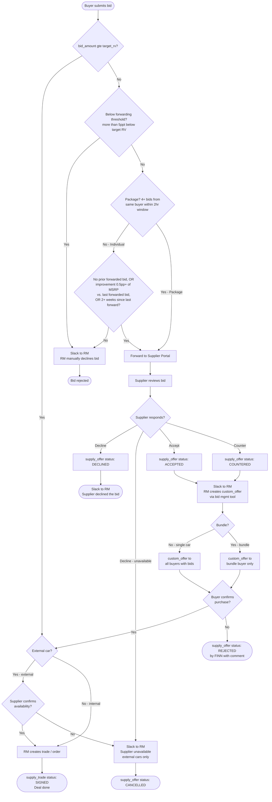

# RaaS Negotiation Flow — Bid Routing & Display Logic

**Status:** In Review
**Author:** Mario Schiefer
**Pillar:** supplier
**Last updated:** 2026-05-08 (Confluence v4 — 2026-05-05)
**Related:** [Confluence source](https://finn.atlassian.net/wiki/spaces/FP/pages/4853661823/PRD+RaaS+Negotiation+Flow+Bid+Routing+Display+Logic) · Jira epic [TBD]

---

## 1. Overview

Defines how buyer bids are collected, filtered, forwarded to suppliers, and how the resulting negotiation is managed across the **Buyer Portal**, **Supplier Portal**, and the internal bid-management tool.

**Automation principle:**

- **Buyer → Supplier** (bid forwarding): fully automatic, governed by the rules in §3–§5
- **Supplier → Buyer** (accepts and counter offers): always manual. Supplier response triggers a Slack notification to the Remarketing Manager (RM), who then creates a `custom_offer` to the relevant buyers via the bid management tool

**Goal:** Get the highest-value buyer bid in front of the supplier without flooding them with noise, while keeping the RM in control of every decline / counter-offer step. Reduce manual RM workload on routing without removing supplier control over pricing.

**Non-goals (in this scope):** Automating the Supplier → Buyer leg; semi-annual analytics reports for suppliers; resolving VIN overlap across bundles.

---

## 2. Process Diagram

Rendered PNG: [`images/raas-negotiation-flow.png`](images/raas-negotiation-flow.png) (kept in sync with the Mermaid source below).

---

## 3. Bid Intake

Every bid submitted by a buyer is collected and stored for analytics regardless of quality. **No bid is silently dropped.**

---

## 4. Bid at or Above Target RV

If `bid_amount >= target_rv`, no supplier negotiation is needed.

| Vehicle type | Action |
|--------------|--------|
| Internal car | No supply_offer created. RM creates trade/order directly. supply_offer is auto-created as ACCEPTED on signing. |
| External car | Goes directly into the external car availability check (see §9). |

---

## 5. Forwarding Block (Too Far Below Target)

Bids more than **5ppt normalized below target RV** are not forwarded to the supplier.

- Bid is blocked from forwarding
- Slack notification fires to the RM
- RM manually declines the bid

**Threshold:** Configurable per supplier. Default is 5ppt normalized below target RV. See [§11 Configurable Settings](#11-configurable-settings).

> Rationale: Protects the supplier from noise while keeping the RM in control of every decline decision.

---

## 6. Forwarding Logic (Individual Bids)

Bids that pass the forwarding block are evaluated for forwarding. For **individual** bids, the following condition must be met:

> **No prior forwarded bid exists, OR the new bid improves by at least 0.5pp of MSRP vs. the last forwarded bid, OR at least 2 weeks have passed since the last forward for this vehicle.**

If none of these conditions are met, a Slack notification fires to the RM who manually declines the bid.

**Package bids skip this check entirely** and are forwarded automatically once they pass the forwarding block (§5).

Thresholds are configurable in Supplier Settings.

---

## 7. Package / Bundle Definition

A bid is treated as a **bundle / package** if it consists of **4 or more bids from the same buyer submitted within a 2-hour window**.

- Fewer than 4 bids: treated as individual
- 4+ bids within 2hr: treated as a bundle, displayed separately in the Supplier Portal

---

## 8. Supplier Portal Display

### Individual bids

- Top offer shown prominently at VIN level
- Supplier can expand to see the full bid spread (e.g. *"5 bids received, ranging from 16.5k to 19k"*)
- Spread builds trust and nudges the supplier toward realistic pricing

### Bundle offers

- Displayed separately from individual bids
- Supplier sees the bundle as a grouped unit
- Clicking in reveals the individual VINs and their respective bids

---

## 9. Supplier Response

The supplier can take one of four actions:

| Action | Who it applies to | What happens |
|--------|-------------------|--------------|
| **Decline** | Any car | `supply_offer` → DECLINED. Slack notification fires to RM. |
| **Decline — unavailable** | External cars only | `supply_offer` → CANCELLED. Slack notification fires to RM. |
| **Accept** | Any car | `supply_offer` → ACCEPTED. Slack to RM. RM creates `custom_offer` to the buyer(s). |
| **Counter** | Any car | `supply_offer` → COUNTERED. Slack to RM. RM creates `custom_offer` to the buyer(s). |

### Accept and Counter: `custom_offer` routing

Both **accept** and **counter** result in the RM creating a `custom_offer` via the bid management tool. Who receives it depends on the bid type:

| Bid type | `custom_offer` sent to |
|----------|------------------------|
| Single car | All buyers who placed a bid on that vehicle |
| Bundle | The bundle buyer only |

### Buyer confirmation flow

After the `custom_offer` is sent:

1. Buyer confirms the purchase
2. If the car is **external**: supplier is asked to reconfirm availability
   - Supplier confirms → RM creates trade/order → `supply_trade` → SIGNED
   - Supplier says unavailable → `supply_offer` → CANCELLED
3. If the car is **internal**: RM creates trade/order directly → `supply_trade` → SIGNED

If the buyer does not confirm: `supply_offer` → REJECTED by FINN with a comment. **No trade is created.**

The car is not considered sold until `supply_trade` reaches **SIGNED**. Before that, all statuses are preliminary.

### Supplier-facing status reference

| Status | Object | Meaning |
|--------|--------|---------|
| **DECLINED** | supply_offer | Supplier declined the bid. No further action. |
| **CANCELLED** | supply_offer | Supplier marked the car as unavailable. |
| **ACCEPTED** | supply_offer | Supplier accepted. Preliminary — buyer not yet confirmed. |
| **COUNTERED** | supply_offer | Supplier submitted a counter price. Awaiting buyer response. |
| **SIGNED** | supply_trade | Buyer confirmed, RM created trade/order. Car is sold. |
| **REJECTED** | supply_offer | Buyer did not confirm after accept or counter. Rejected with comment. No trade is created. |

---

## 10. External Car Availability Check

For external cars, supplier availability must be confirmed before the trade is created. Applies regardless of how the car reached this point (above target RV, accepted bid, or countered bid).

- Supplier confirms → RM creates trade/order
- Supplier says unavailable → `supply_offer` → CANCELLED, Slack to RM

---

## 11. Configurable Settings

| Setting | Default | Description |
|---------|---------|-------------|
| Forwarding block threshold | 5ppt normalized below target RV | Bids below this trigger manual RM decline, not auto-forwarding |
| Minimum price improvement | 0.5pp of MSRP | Minimum improvement over last forwarded bid to re-surface |
| Forwarding time window | 2 weeks | Fallback forward even without price improvement |
| Package minimum size | 4 bids within 2hr window | Minimum to qualify as a bundle |

---

## 12. Analytics & Reporting

All bids are stored regardless of outcome, enabling:

- Tracking average bid values per vehicle / brand
- Understanding spread between lowest and highest bids
- Reporting to supplier on market demand (e.g. "5 bids received, ranging from 16.5k to 19k")
- *Future:* semi-annual reports for suppliers showing bid volume, average, and sell-through rates

---

## 13. Open Questions

- How to resolve VIN overlap between multiple bundles
- When (if ever) to automate the `custom_offer` step (vs. Slack + manual RM)
- How to display bundles cleanly in the Sales Portal
- Semi-annual reporting format for suppliers
- Whether buyer confirmation loop can be skipped for accepted bids if SLAs are tight enough (needs alignment with Christoph at Nissan — see [`../../suppliers/accounts/nissan/account-context.md`](../../suppliers/accounts/nissan/account-context.md))
- For above-target external cars: when and how is the `supply_offer` created before the availability check fires
